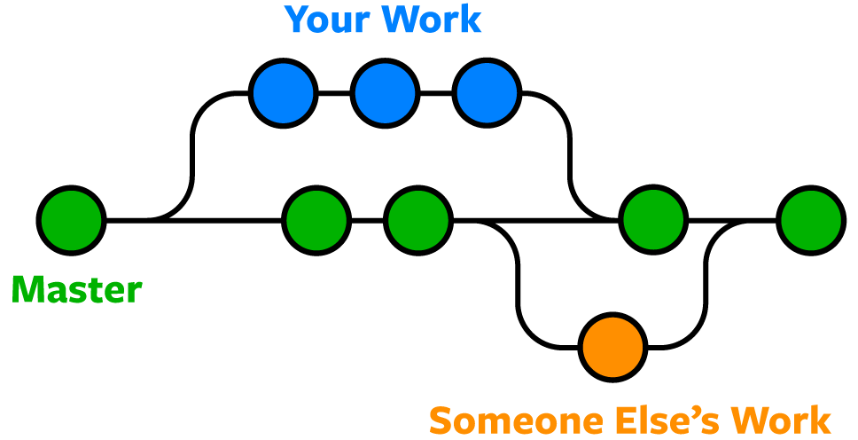

import { Aside } from '@astrojs/starlight/components';
import { Steps } from '@astrojs/starlight/components';

A branch in Git is an independent line of development that allows multiple versions of a project to exist simultaneously. Branches are useful for developing features, fixing bugs, or experimenting without affecting the main codebase.

The main codebase is also stored in its own branch called `main` ([which you created](../repositories/#32-creating-and-linking-a-new-remote-repository-on-github) when linking your local repository to your remote repository on GitHub!). Developers create branches to work on separate tasks without interfering with each other's progress. Once a branch is complete, it can be merged back into the `main` branch.

<Aside type="tip" title="Naming Discrepancy">
The default branch was not always named `main`--this was a naming convention change by many cloud-based services including GitHub in 2020. In some older projects, you may encounter the old branch name, `master`, as the default branch. In fact, figure 5.0.1 below features this older naming standard.
</Aside>


*Figure 5.0.1: Visualization of how branches work. [source](https://learncsdesigns.medium.com/a-review-of-git-branching-strategies-3a519a0d7b2e)*

## 5.1. Creating and working in a branch

To create a new branch, use the following command:

```bash frame="none"
git branch <branch-name>
```

This creates a branch but does not switch to it. To move into the new branch, use:

```bash frame="none"
git checkout <branch-name>
```

Alternatively, you can create and switch to a new branch in a single command:

```bash frame="none"
git checkout -b <branch-name>
```

After creating a branch, any changes made will be isolated from the main branch until merged.

## 5.2. Merging

Once changes in a branch are complete, they need to be merged into the main branch. 

<Aside type="danger" title="Warning">
Directly merging as shown below is rarely used in a professional and/or team environment. Instead, refer to [Pull requests with GitHub](#53-pull-requests-with-github).
</Aside>

First, switch to the main branch:

```bash frame="none"
git checkout main
```
Then merge the changes from the feature branch:

```bash frame="none"
git merge <branch-name>
```

If conflicts arise, Git will prompt you to resolve them before completing the merge.
<Aside type="caution" title="Preventing Merge Conflicts">
Merge conflicts can get pretty nasty on large scale projects! It is recommended to carefully consider how you divide work among your team.
</Aside>


## 5.3. Pull requests with GitHub
On GitHub, merging is commonly done through a pull request (often abbreviated as "PR"). A pull request allows collaborators to review code before merging. To create a pull request:

<Steps>

1. Push your branch to GitHub:

   ```bash frame="none"
   git push -u origin <branch-name>
   ```

2. Navigate to the repository on GitHub and click **New Pull Request**.
3. Select your branch and compare changes with the main branch.
4. Click **Create Pull Request**, add a description, and submit for review.

</Steps>

Once approved, the pull request can be merged into the main branch through the GitHub web interface.


## 5.4. Advanced branch tools

```bash frame="none"
git branch -d <branch-name> 
```

Deletes a branch after merging.

```bash frame="none"
git branch -D <branch-name>
```

Forces deletion of a branch, even if it has unmerged changes.

```bash frame="none"
git rebase <branch-name>
```

Reapplies commits from one branch onto another, ensuring a linear commit history.
