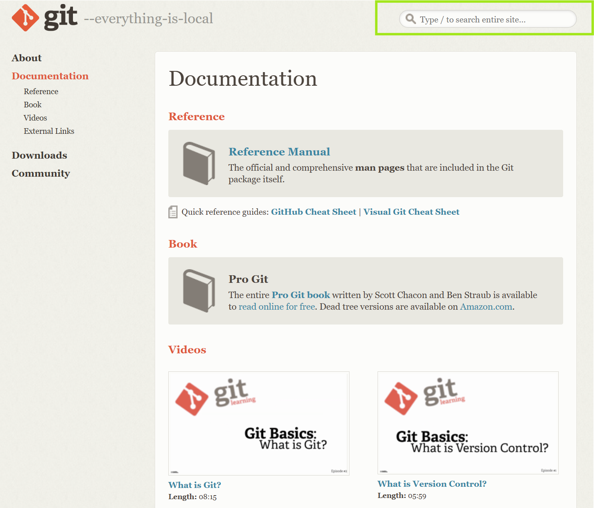

## 6.1. Command Documentation
At this point, you've learned the basics of the Git Command Line, congratulations! With the commands you've learned thus far, you've likely mastered the most pertinent uses of a version control system. 

Beyond the basics, Git Command Line contains a plethora of other commands for you to master. Official documentation of all Git commands is available [here](https://git-scm.com/doc).

*Figure 6.0.1: Git's documentation, where you can search for all commands.*

While many of the commands you may find may be niche for your specific needs, Git commands can greatly increase your version control efficiency. 

To clarify, these commands are not essential for use of Git--learning and mastering every Git command out there is likely a waste of time. Instead, it is recommended to simply search online for your desired use case. Software development forums like Stack Overflow often contain suggestions for certain Git commands--once you locate one that sounds useful, you should refer to the documentation.

## 6.2. GitHub Desktop
You can also check out [GitHub Desktop](https://github.com/apps/desktop), a desktop application with a modern user interface that can make your version control workflow smoother.