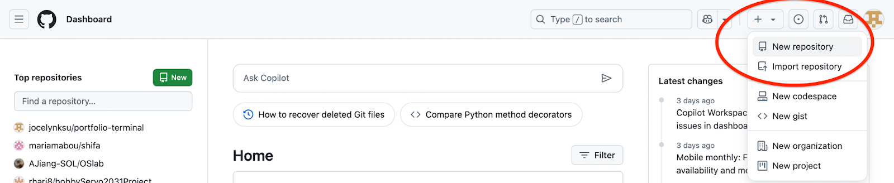
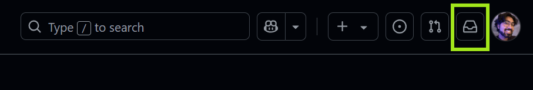
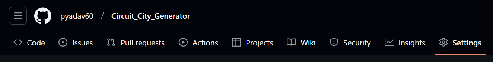
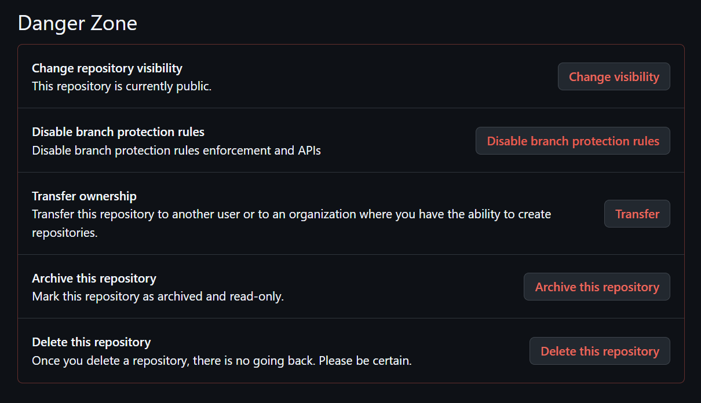

import { Aside } from '@astrojs/starlight/components';
import { Steps } from '@astrojs/starlight/components';
import { FileTree } from '@astrojs/starlight/components';
import { Tabs, TabItem } from '@astrojs/starlight/components';

A repository (commonly shortened to “repo”) is a directory where Git is enabled. Because of Git, developers can use all the version control features that Git provides, also enabling the ability to set up and use GitHub with their project. Before we get started, it is necessary to know the difference between a **local repository** and a **remote repository**:
- **Local Repository**: A Git repository (in this case, the project you are about to make) that is stored on your own computer.
- **Remote Repository**: A Git repository that is stored somewhere else, commonly on the cloud (e.g. GitHub, which allows essential collaboration features and backup).

## 3.1. Creating a New Local Repository
When starting a project from scratch, you will typically first create a **local repository** on your computer, which you will then link to a **remote repository** on GitHub so that you can sync your code with the cloud. To begin, let's focus on creating your first local repository.
<Steps>
1. **Create a new directory** in a (preferably easily accessible) location of your choice, such as your desktop. Name it `my-first-repo`.
   
   <Aside type="caution" title="Caution">
   While Git allows any directory name supported by your computer's filesystem, GitHub enforces specific naming rules: repository names must contain only ASCII letters, digits, `.`, `-`, and `_`. Ensure these requirements are followed for consistency between local and remote repositories.
   </Aside>
   
   <Aside type="note" title="Repository Naming Conventions">
   Be sure to follow [common repository naming practices](https://stackoverflow.com/a/30529354). It is generally recommended to use all lowercase, be specific about what the repository contains, and replace spaces with hyphens (spaces are not allowed in GitHub repository names).
   </Aside>

2. **Initialize Git in the project directory** to enable version control. This is where our first Git command comes into play--`git init`. This command will initialize Git in the current directory, enabling all of Git's version control features to work and start tracking the project locally. Using your computer's terminal, **navigate to your project directory and run** `git init`.

   <Tabs>
     <TabItem label="Windows">
       ```batch
       cd C:\Users\YOUR_USERNAME\Desktop\my-first-repo
       git init
       ```
     </TabItem>
     <TabItem label="Mac/Linux">
       ```bash
       cd ~/Desktop/my-first-repo
       git init
       ```
     </TabItem>
   </Tabs>

   Running `git init` creates an invisible `.git` directory, where Git stores version control data.
   <Aside type="tip" title="Quickly access the project directory">
   On Windows, instead of opening command prompt, you can right-click inside the project directory and select **Open Git Bash here**. It will open a special terminal for Git commands and automatically place you in the project directory.
   </Aside>
</Steps>

Congratulations! You've just created your first local repository. Now, let's **set up a remote repository** on GitHub and **link it with our local repository**.

## 3.2. Creating and linking a New Remote Repository on GitHub
<Steps>
1. Navigate and log in to GitHub in your web browser. On the upper right hand corner of the navigation bar in the dashboard, click the + button and select **New repository**. It will direct you to a page titled **Create a new repository**.
  
  *Figure 3.2.1: creating a new repository on GitHub.*

2. Here, you can name your repository and select privacy permissions. You will also have the option to include a `README` file, which is just a file included in many project repositories. It typically provides essential information about a project, including its purpose, installation instructions, usage guidelines, and any dependencies. For now, leave everything default (unchecked), name the repository `my-first-repo`, and click **Create repository.**

3. You should be redirected to the page for your new (empty) repository. In order to link your local repository with your newly created remote repository, copy the URL of the page, navigate to your local project directory using terminal, and enter the following commands:

   ```bash
   git remote add origin <repository-url>
   git branch -M main
   ```
</Steps>

Your local repository is now linked with the remote repository on GitHub!

## 3.3. Cloning a Repository
Many times when you start working on a project, the chances are that development is already taking place and the project already exists as a remote repository on GitHub. In this case, you will need to **clone the repository** to your computer. This is similar to copying the latest code from the GitHub repository onto your local machine, but with the addition of setting up and linking a local Git repository so your work can be synced to GitHub.

<Steps>
1. **Navigate to the main page of the repository** on GitHub. If you need a repository to follow along with, try cloning [this one](https://github.com/githubtraining/hellogitworld).

2. Above the list of files, click the green `< > Code` button. You'll see there are 3 different options to copy the URL:
   - **HTTPS** is used when cloning the repository normally, which is what this guide will be focusing on.
   - **SSH** is used if you have a certificate issued by your organization, and is typically used in professional and enterprise settings.
   - **GitHub CLI** is used if you are cloning your repository in your terminal using GitHub CLI.

   Copy the **HTTPS** URL for the repository.

3. Once you have your HTTPS link copied to your clipboard, use your computer's terminal to navigate to a location where you want to store the project locally, and then use the `git clone` command with the HTTPS URL. Again, in this example, we will clone it to the desktop.
   <Tabs>
     <TabItem label="Windows">
       ```batch
       cd C:\Users\YOUR_USERNAME\Desktop
       git clone https://github.com/USERNAME/PROJECT.git
       ```
     </TabItem>
     <TabItem label="Mac/Linux">
       ```bash
       cd ~/Desktop
       git clone https://github.com/USERNAME/PROJECT.git
       ```
     </TabItem>
   </Tabs>
   <Aside type="tip" title="Tip">
   You do not need to create a new directory when cloning a remote repository--Git will create one for you based on the name of the remote repository.
   </Aside>
</Steps>

Congratulations, you've just cloned your first repository!

## 3.4. Ownership and Privacy
A repository can be owned individually, or by multiple collaborators. Collaborators will have to invite you to their repositories via email.


*Figure 3.4.1: View pending invites under the notifications tab.*

You can view pending invites to repositories under the notifications tab in the top right.

When you create a repository, you can choose to make it either public or private. This can be easily changed within repository settings after the matter.


*Figure 3.4.2: The Settings tab in a repository.*


*Figure 3.4.3: The "Danger Zone," where repository visibility can be changed.*

If you're showing off work to employers, you can grant them access to a private repository with a key.

<Aside type="caution" title="Security Concerns">Carefully consider the visibility when managing repositories of sensitive code.</Aside>