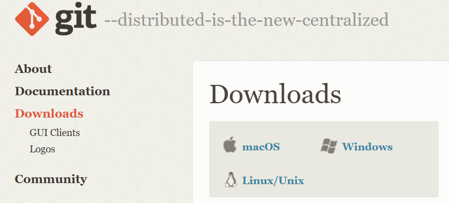
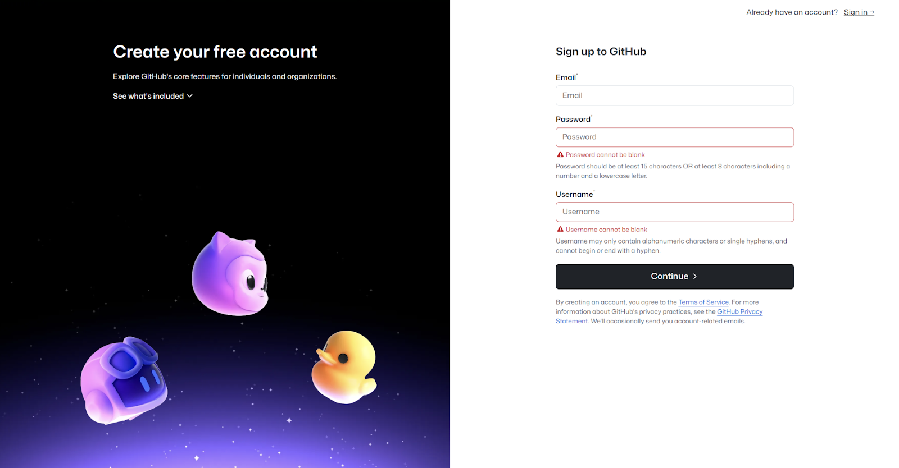

import { Aside } from '@astrojs/starlight/components';

In this section, you will learn how to install Git on your local machine, as well as create a GitHub account.

<Aside type="caution" title="Security Concerns">As a collaborative platform, GitHub provides a powerful environment for sharing and managing code, but it also introduces security risks—especially when working with private code in academic settings or within a company. Understanding GitHub's security features and best practices can help protect sensitive code from unauthorized access and leaks. Throughout this guide, we will teach you the important steps to take when setting up your code in GitHub to ensure safety and reliability. </Aside>

## 2.1. What do I need to start?

To follow along with this guide, you will need:

- A computer running Windows, Mac, or Linux
- Internet connection
- An open mind :D

## 2.2. Installing Git

First, you will need Git installed on your machine. This will enable you to use all the Git commands on your computer.

Visit Git's official website [here](https://git-scm.com/downloads) for installation instructions and download. There are specific installs available for different operating systems, so ensure you select the correct one.

*Figure 2.2.1: Git download page.*

## 2.3. Making a GitHub Account
You can register to GitHub for free [here](https://github.com/signup).

*Figure 2.3.1: GitHub registration page.*
<Aside type="caution" title="Safety Precaution">Be sure to create a sufficiently complex password -- your repositories are important!</Aside>
